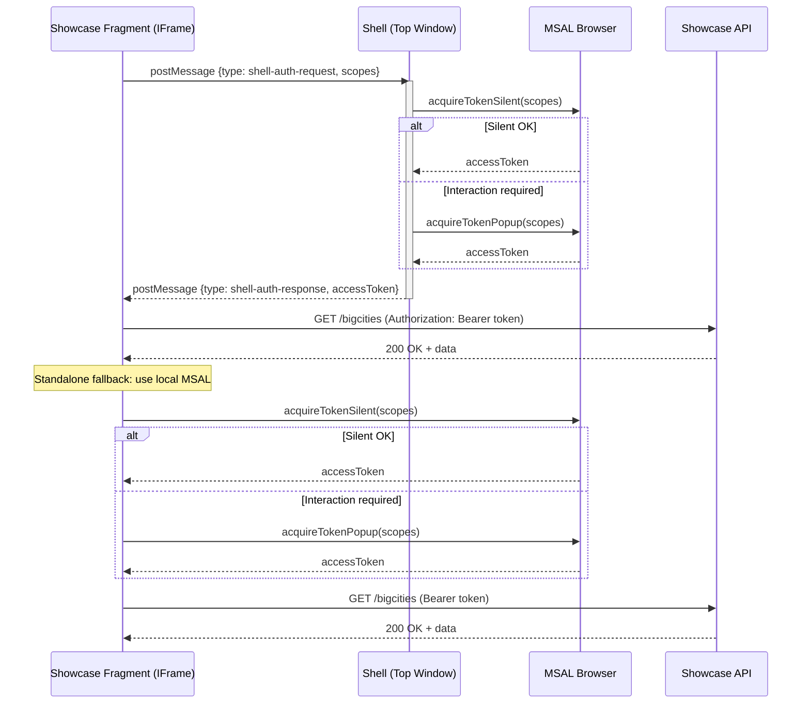

# Token Broker Flow (Shell + Fragment)

## Übersicht

Das Token-Handling funktioniert nach folgendem Prinzip:

1. **Shell-Ebene**: Verwaltet die MSAL-Instanz und stellt als "Broker" Tokens bereit
2. **Fragment-Ebene**: Fragt Tokens über `postMessage` von der Shell an, fällt auf lokales MSAL zurück (Standalone)
3. **Sicherheit**: `MessageChannel` für sichere Cross-Origin-Kommunikation, optional mit Origin-Allowlist

## Ablauf im Detail



## Implementierungsdetails

### Shell-Seite (`shell/src/auth/tokenBroker.ts`)

- **`registerTokenBroker(msalInstance)`**: Registriert den Broker beim Shell-Start
  - Exponiert `window.shellAuth` (für Same-Origin, schneller Direktzugriff)
  - Lauscht auf `postMessage`-Anfragen mit `MessageChannel`
  - Validiert die Anfrage-Origin gegen `VITE_FRAGMENT_ORIGINS` (optional)
  - Nutzt `acquireTokenSilent()` mit Fallback auf `acquireTokenPopup()`

### Fragment-Seite (`showcase-fragment/src/auth/tokenBroker.ts`)

- **`getShellAccessToken(scopes)`**: Versucht Token von der Shell zu holen
  1. Prüft, ob eingebettet (`window.self !== window.top`)
  2. Versucht direkten Zugriff: `window.parent.shellAuth?.getAccessToken()`
  3. Fällt auf `postMessage` + `MessageChannel` zurück (Cross-Origin)
  4. Bei Fehler: Gibt `null` zurück → Fragment nutzt lokales MSAL

### API-Call (`showcase-fragment/src/api/bigcities.ts`)

```typescript
const brokerToken = await getShellAccessToken(loginScopes);
const accessToken = brokerToken ?? (await acquireLocalToken());
// ... Token verwendet für API-Request
```

## Sicherheit

- **Origin-Validierung**: Shell prüft `event.origin` gegen `VITE_FRAGMENT_ORIGINS`
- **MessageChannel**: Sichere bidirektionale Kommunikation ohne globale Event-Listener
- **Timeout**: Fragment wartet max. 5 Sekunden auf Shell-Antwort
- **Fallback**: Fragment läuft vollständig unabhängig auch ohne Shell

## Konfiguration

### Shell (`.env`)

```env
VITE_FRAGMENT_ORIGINS=https://localhost:5176,https://app.example.com
```

Wenn leer: Alle Origins akzeptiert (nur für Entwicklung!)

### Fragment

Keine zusätzliche Konfiguration nötig. Funktioniert automatisch:
- **Embedded** (`https://localhost:5173/showcase/`): Nutzt Shell-Broker
- **Standalone** (`https://localhost:5176/showcase/`): Nutzt lokales MSAL

## Fehlerfälle

| Szenario | Verhalten |
|----------|-----------|
| Fragment nicht eingebettet | `getShellAccessToken()` gibt `null` zurück → lokales MSAL |
| Shell nicht verfügbar | `postMessage` timeout → lokales MSAL |
| Benutzer nicht angemeldet (Shell) | Fragment erhält Fehler → peut übernehmen oder `acquireTokenPopup()` zum Anmelden auffordern |
| Cross-Origin (blockierte Origin) | Shell ignoriert Request → lokales MSAL |

